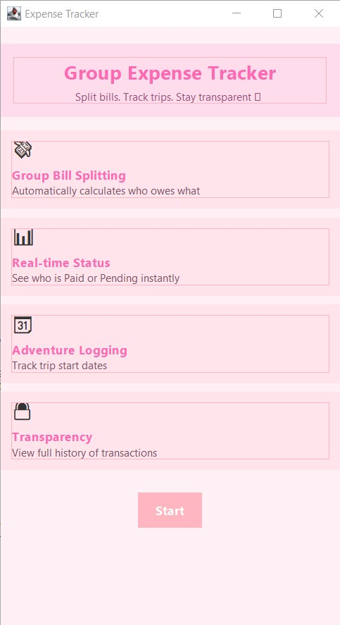
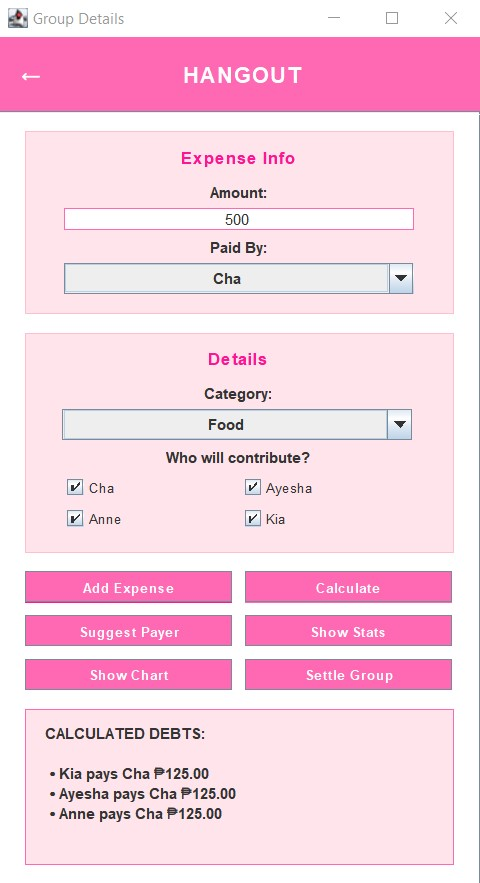

# 💸 Bill Splitter App

> A Java desktop application that helps groups split expenses and track payments during hangouts, trips, or events.

---

## 📱 About the App

The Bill Splitter App is designed to simplify expense sharing among friends during hangouts, trips, or events. Users can create groups, add members, and record expenses with assigned payers

The system automatically calculates how much each member owes and generates a simplified list of transactions (e.g., A pays B ₱100).

It also tracks payment status and stores completed transactions in a history log for future reference.

---

## 👀 Preview

<table width="100%">
  <tr>
    <td align="center" width="50%">
      <strong>Homepage</strong><br><br>
      
    </td>
    <td align="center" width="50%">
      <strong>Expense Sample</strong><br><br>
      
    </td>
  </tr>
</table>

---

## 🎯 Features

- 🧾 Create multiple groups or events
- 👥 Add members and expenses
- 💸 Assign who paid each expenses
- ⚖️ Automatic balance computation
- 🔄 Smart payment breakdown
- 📊 Summary insights (top spender, total spent,...)
- ✅ Payment tracking (Settled/Not Settled)
- 📁 Expense history breakdown

---

## 🛠️ Technologies Used

| Technology | Purpose |
|---|---|
| **Java** | Core application logic and programming |
| **Maven** | Project and dependency management |
| **NetBeans** | Development environment |
| **Git & GitHub** | Version control and project distribution |
| **ChatGPT & Gemini** | Troubleshooting and development assistance |

---

## 🔑 Key Systems & Features

### 💰 Group Bill Splitting
- Automatically calculates and distributes shared expenses among group members.

### 📊 Payment Status Tracking
- Tracks member balances and identifies who has paid or still has pending payments.

### 🗓️ Trip & Adventure Logging
- Records trip start dates and organizes expenses around group activities.

### 📋 Transaction History & Transparency
- Maintains a transparent record of expenses and payments for easy review.

---

## 👩‍💻 My Contributions

My contributions to the project included:

- Designing and implementing layout design
- Developing and debugging the application
- Testing and troubleshooting the application
  
---

## 🚀 Running from Source

### Requirements
- Java JDK 25
- Apache NetBeans IDE 28
- Maven (For project build and dependency management)
- Operating System: Windows 10/11

### Steps
1. Clone the repository:
      ```bash
   git clone https://github.com/kiacodesss/bill-splitter-app.git
   ```

3. Open Apache NetBeans, click File → Open Project
4. Select the downloaded project folder, then wait for maven to load dependencies
5. Download the JAR from the release folder and run: BillSplitterApp-1.0-SNAPSHOT-jar-with-dependencies

## 📦 Release

**[Download Bill Splitter App for Windows](../../releases/latest)**

A ready-to-run release is available under GitHub Releases.

1. Download `BillSplitterApp-1.0-SNAPSHOT-jar-with-dependencies.jar` from the latest release.
2. Double-click the jar file.
3. Enjoy the application!
   
---

## 🎓 Project Information

The Bill Splitter App was developed collaboratively as part of a Hackathon competition project.

---

## 💡 Authors

### Charlene Dungo
🔗 GitHub: https://github.com/charlenedungo

### Ayesha Caragay
🔗 GitHub: https://github.com/caragayayesha

### Shanen Anne Mirador
🔗 GitHub: https://github.com/vanravna

### Kiana Yeo
🔗 GitHub: https://github.com/kiacodesss

---

## 📄 License
This project is for educational and portfolio purposes.
